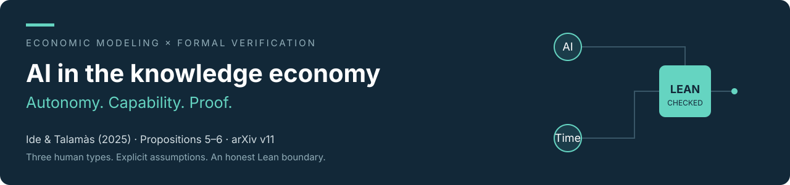

  

  
  
  
  

  <a href="presentation.pdf"><strong>Read the slides</strong></a> ·
  <a href="analysis/derivation.md">Follow the derivation</a> ·
  <a href="lean/FirmAlgebra.lean">Inspect the proof</a> ·
  <a href="lean/docs/RUN_REPORT.md">See the honest status</a>

**Ide, Enrique, and Eduard Talamàs (2025), _Artificial Intelligence in the Knowledge Economy_.** Read: course PDF, May 20, 2025 (39 pp), cross-checked against **arXiv v11, February 25, 2025 (35 pp)**, the Lean pin. [Version details](paper/README.md).

> **The central lesson:** autonomy determines AI's permitted roles; capability determines which problems it solves. **Both** shape who gains at the bottom, who gains at the top, and total output.

### The question and the agent's problem

Who gains when scalable AI enters an economy where workers encounter problems and knowledgeable solvers handle exceptions? Humans maximize income; competitive firms choose occupations, matches, and AI use to maximize profit. For worker knowledge $z$, solver knowledge $s>z$, and helping cost $h$:

$$n(z)=\frac{1}{h(1-z)},\qquad \Pi_{HH}=n(z)[s-w(z)]-w(s).$$

Free entry sets active profits to zero; human time and compute markets clear. AI replaces the relevant wage with rental $r$.

### Main results · Propositions 5 and 6

| Comparison | Bottom | Top / output |
|:--|:--|:--|
| **Autonomous AI vs. no AI — P5** | Strict winners **iff $a>\bar a$**, with $\bar a\in\operatorname{int}W$, the pre-AI worker set. | Some top winners for every $a<1$. Winners occupy endpoint intervals; the human with knowledge $a$ loses. |
| **Co-pilot-only AI — P6** | If $a\le w(0)$: unused, wages and occupations unchanged. If $a>w(0)$: adoption by the least knowledgeable and strict bottom gains. | Near the top, $w^N\le w^A$, strict away from $z=1$. **$Y^A>Y^N$.** |

P6 also gives a unique equilibrium, efficiency and maximal labor income **within that technology**, and $r^N=0$. Near zero, $w^N\ge\max\{w,w^A\}$; some $z>0$ has $w^N(z)\le w(z)$; both comparisons are strict when $a>w(0)$. With adoption, AI-assisted workers, human-assisted workers and human solvers are nonempty; independent humans may be absent. These are local endpoint claims, not rankings of every human.

**Conditions matter.** Unit human mass, one time unit each; observable $z\in[0,1]$ with continuous positive density; independent uniform difficulties; risk neutrality, output price one, complete information, competition, no fixed costs, at most two layers. Require **$0<h<h_0$**, **$a<1$**, abundant production opportunities, and compute abundant relative to human time. A sufficient compute bound is

$$\mu>\int_0^a h(1-z)\,dG(z)+\frac{1-G(a)}{h(1-a)}.$$

P6 compares the **same capability and compute supply** across autonomy regimes. The thresholds $\bar a$ and $w(0)$ are distinct.

### From a hand calculation to Lean

For three types $(0,\frac12,1)$, masses $(.55,.30,.15)$, $h=\frac12$ and $\mu=2$, baseline wages are $(.2,.6,1.6)$. On the autonomous branch $0<a<\frac13$:

$$w_L^A=\frac{a}{2(1-a)},\qquad w_L^A>\frac15\iff a>\frac27.$$

The [numerical checks](checks/computation.txt) verify resource feasibility, no profitable entry, duality, wage uniqueness and income accounting. **This finite example illustrates the mechanism; it does not prove the continuum result.**

| Lean evidence | Meaning |
|:--|:--|
| [Firm wage proof](lean/FirmAlgebra.lean) | Zero profit implies $w=a-h(1-z)r$, given explicit bounds. |
| [Discrete threshold proof](lean/DiscreteCalculations.lean) | Both directions of the candidate-wage inequality are checked. |
| [Fast check: passed](checks/lean-check.md) | Build and whitespace passed; **not** full source verification. |
| [Coverage: partial](lean/docs/RUN_REPORT.md) | **0/6 continuum propositions proved.** Source Specs, equilibrium machinery and semantic closeout remain open. |

`lean/` preserves the complete original run unchanged. Badges describe that recorded run, not live CI. The [new presentation-only boundary check](analysis/BoundaryCheck.lean) is separate from that snapshot.

**Finish and reproduce:** add your genuine [handwritten photograph](hand/README.md), then run `make analysis slides` with the [dependencies](requirements.txt) installed. [Rehearsal notes](analysis/presentation-notes.md) allocate 20 minutes, with exactly six slides on Lean. [Raw prompts](prompts.md) preserve the actual exchange. The handwritten requirement is **still pending**.
